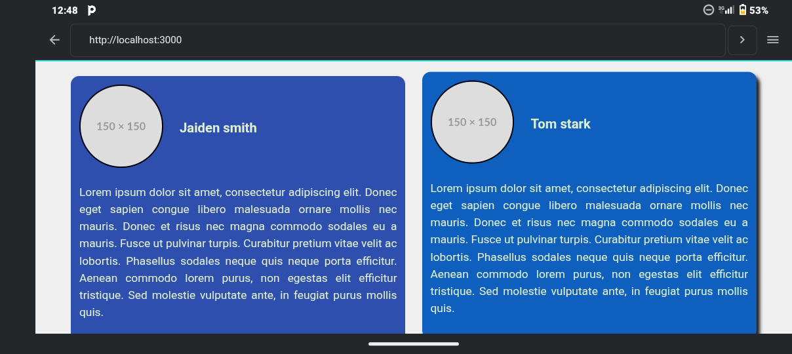

<h1 align="center">🌟 Our Team Flexbox Project 🌟</h1>

  A responsive team section built with pure HTML and CSS Flexbox.

  
  
  
  
  

---

## 🚀 Live Preview

👉 **View Site:** [Our Team Flexbox](https://benedictsamuel163-blip.github.io/Our-team-flexbox/)

---

## 🖼️ Project Screenshot

  <!-- Upload your screenshot to your repo and rename it 'preview.png' -->
  
  

---

## 🧩 Features

- 📱 **Fully responsive layout** built with Flexbox
- 🎨 Modern CSS design and color scheme
- ⚡ **No JavaScript** — pure front-end power
- 🧠 Developed during your Flexbox learning journey

---

## 🛠️ Technologies Used

- **HTML5**
- **CSS3 (Flexbox)**
- **Termux + Git**
- **GitHub Pages**

---

## 🧑‍💻 Author

**Ben (Scholar Junior)**  
💬 _“I build things that make learning fun and visual.”_

- GitHub: [@benedictsamuel163-blip](https://github.com/benedictsamuel163-blip)
- Email: benedictsamuel163@gmail.com

---

## ⭐ Contribute or Fork

Want to improve this project or learn from it?  
Fork it, tweak it, and share your own version — that’s how you grow as a dev!

---

  Made with ❤️ and ⚙️ in <b>Termux</b>

